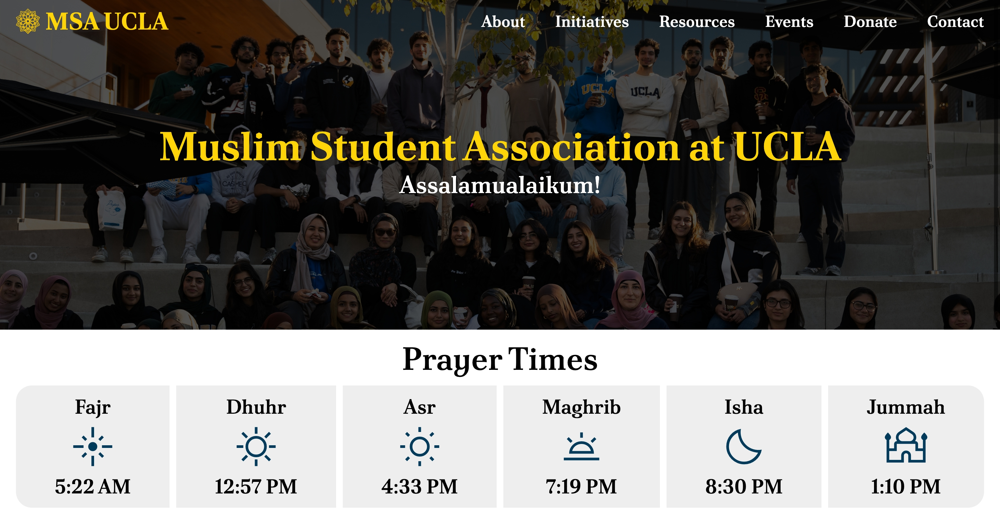

# 🕌 MSA UCLA Website

The official open-source website for the Muslim Student Association at UCLA. Built to serve hundreds of Muslim Bruins with resources, events, and essential MSA initiatives.



## 🖥️ Demo

The website is currently deployed at [msaucla.com](https://msaucla.com).

## ⭐️ Features

- 📅 **Dynamic event calendar** synced with Google Calendar
- 💻 **Fully responsive design**; optimized for both desktop and mobile
- 🎨 **Modern UI** designed in Figma with a clean, Islamic aesthetic
- ✍️ **Easy editability** with [`data/*.json`](/data) files for projects and committees

## 🚀 Installation

You will need `npm` and Node.js v18+ to run the website on your local computer.

Run the following commands:
```sh
git clone https://github.com/NajmKHoda/msa-ucla-website.git
cd msa-ucla-website
npm install
npm run dev
```

The website should now be live at [`http://localhost:3000`](http://localhost:3000).

## 💪 Contributors

- **Najm Hoda** - Lead website developer and designer
- **MSA Public Relations** - Website image provider
- **MSA External Affairs** - MSA Resources